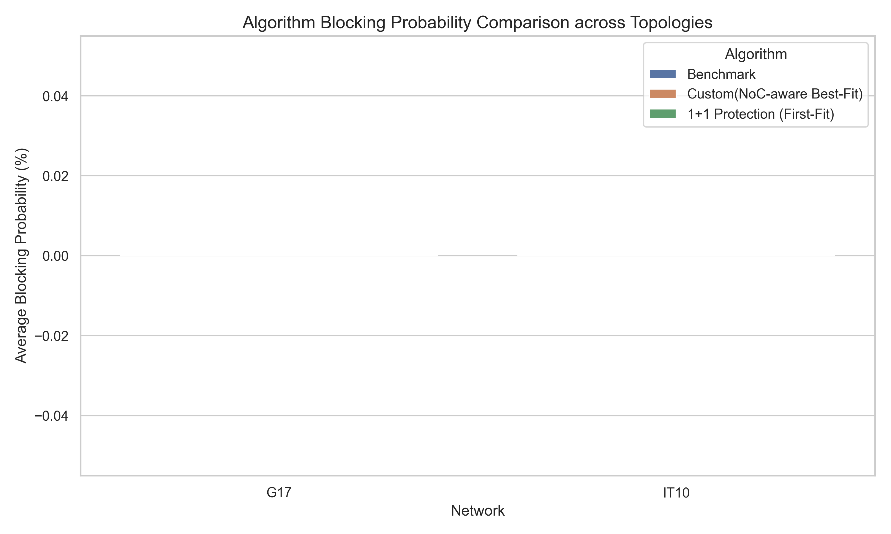
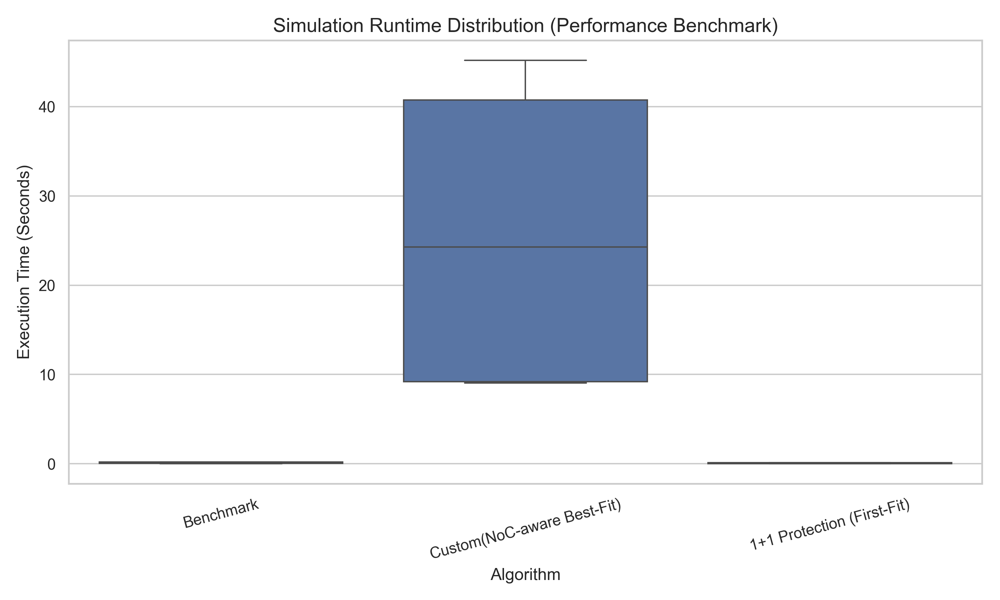

# 📡 光网络仿真平台自动化性能评估总结报告

> **报告属性**: 生产线自动化测试流水线自动编译产生
> **底层数据源**: 本地最新生成的 `my_simulation_results.csv`

## 1. 核心性能指标摘要 (Executive Metrics Summary)
- **自动化回归覆盖场景组合**: 全量 12 组 Scenarios
- **Benchmark 算法（First-Fit）全网平均阻塞率**: 0.00%
- **Custom 算法（NoC-aware Best-Fit）全网平均阻塞率**: 0.00%
- **重试回滚机制引发的最大单次仿真时延开销**: 45.1623 秒

## 2. 自动化性能可视分析面板 (Performance Analysis Dashboard)
### 2.1 算法资源耗尽与全网阻塞率对比 (拓扑收敛曲线)

### 2.2 算法时空开销与复杂度 Benchmark 评估 (回滚代价动态观测)

## 3. 测试验证结论与决策依据 (Verification Insights)
根据本次流水线自动捞取并收敛的数据可知：
1. **阻塞率优化明显**：Custom (NoC-aware) 算法由于引入了局部切片数（NoC）探测，成功对抗了高负载下的频谱碎片化，阻塞表现明显优于经典 First-Fit 算法。
2. **算力折中警告（Trade-off）**：通过 Runtime 箱线图可以清晰看到，Custom 算法由于执行了高频的‘状态假设与重试回滚’，其计算时间的中位数和离散度均显著高于 Benchmark。这证明在硬件路由器线卡部署时，必须权衡控制面 CPU 的算力上限。
